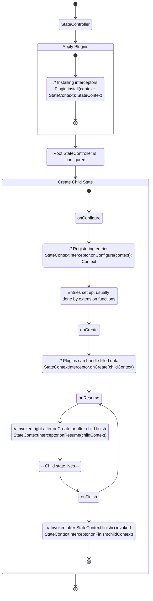

# Phases

KSM is based on different callbacks and interceptors and therefore,
there are some phases you should be aware about.

Note: There is no `Phase` in the library as an interface or something
similar, it's just a good mental model.

## Visual Scheme



## Plugin Installation

First phase is a plugin installation. This is where a life of the
root `StateController` begins. This is where all plugins install
their interceptors and store configuration:

```kotlin
class CoroutinesPlugin(
    // Configuration is just plugin properties
    val context: CoroutineContext
) : Plugin {

    override fun install(context: StateContext) {
        return context + StateContextInterceptor(context)
    }
}
```

Plugins can be installed using `createRawStateController` function.
It is called 'Raw' because there is no plugins except builtins and
the end user probably should not use this function. The function
is used by creators of libraries that integrates ksm into some ecosystems.
For example:

```kotlin
fun createTelegramKSM(): StateController {
    return createRawStateController {
        install(TelegramKSM)
    }
} 
```

### Restrictions

- **Do not read properties from `context`, only write them**

  Current context is incomplete and will be modified at
  later point of time by another plugins, so you should
  not save it or read any properties from it

## State Phases

The following phases relate to creation of child states, and they
are being invoked at `StateContext.createChildContext`. And
all the following methods are methods of `StateContextInterceptor`

### onConfigure

When creating a new `StateContext`, the first method that is being
invoked is `onConfigure`. Let's look at the signature:

```kotlin
fun onConfigure(context: StateContext): StateContext
```

It takes context and returns context and this is the place where
you can register entries scoped to child context. Continuing with
the example with coroutines:

```kotlin
class CoroutinesContextInterceptor(
    val initialContext: CoroutineContext
) : StateContextInterceptor {
    override fun onConfigure(context: StateContext): StateContext {
        val previousEntry = context[CoroutinesEntry]
        // Support for structured concurrency
        return context + CoroutinesEntry(previousEntry)
    }
}
```

#### Restrictions

- **Do not set any interceptors**

  There is a chance that interceptor that you try to set was already
  invoked earlier by another plugin and if you set interceptor at that phase,
  it will lead to inconsistent behaviour in different cases


- **Do not read from context except for entries under plugin control**

  Even though it is guaranteed that interceptors of plugins are called in
  the order that plugins were registered, it's you should not access other
  plugins in `onConfigure` method. _This is to be discussed, but there is
  no seemed reason for this to be allowed._

### onCreate

Continuing with `StateContext.createChildContext`:

```kotlin
fun StateContext.createChildContext(apply: (StateContext) -> Unit) {
    // All plugins register their entries
    val childContext = this.onConfigure(applied)
    // This is where all the setup of entries happens
    apply(childContext)
    childContext.onCreate()
}
```

As we can clearly see from the current code snippet, onCreate is called
when all context entries were set up. What does set up mean? Let's consider
the following simplified example:

We have `NavigationPlugin`, which registers `NavigationEntry` in
`NavigationInterceptor` in `onConfigure` method, similarly to the
previous example:

```kotlin
class NavigationInterceptor {
    override fun onConfigure(context: StateContext): StateContext {
        return context + NavigationEntry()
    }
}
```

And the `NavigationEntry` itself looks like this:

```kotlin
class NavigationEntry {
    var route: String? = null
}
```

It is expected that `route` will be set in `apply` lambda of 
`createChildContext` function. And `onCreate` is a perfect place to receive it:

```kotlin
class NavigationInterceptor(
    private val controller: NavController
) {
    override fun onConfigure(context: StateContext): StateContext {
        return context + NavigationEntry()
    }
    
    override fun onCreate(context: StateContext) {
        val entry = context.require(NavigationEntry)
        val route = entry.route ?: return
        controller.navigate(route)
    }
}
```

### Other Lifecycle Events

Also, there are other lifecycle events:

- `StateContextInterceptor.onResume` – when context after this was finished
- `StateContextInterceptor.onFinish` – when context was finished
